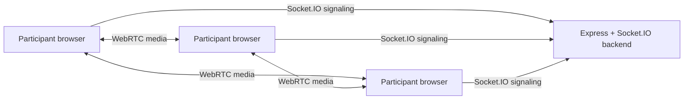

# Guest Video Meet

A lightweight Zoom/Microsoft Teams-style group video conferencing app for small guest meetings. It uses a Next.js frontend, an Express + Socket.IO signaling backend, and browser WebRTC peer-to-peer mesh connections for up to five participants.

No registration, login, email address, OTP, password accounts, Google authentication, database, media server, paid TURN server, or third-party video API is required.

## Features

- Guest display-name entry only
- Create and join meetings with URLs like `/meeting/ABC123`
- Secure browser-generated meeting IDs
- Copy meeting link and Web Share API support
- WebRTC audio/video mesh for up to five people
- Mute/unmute microphone
- Camera on/off
- Screen, window, or tab sharing through `getDisplayMedia`
- Responsive adaptive video grid
- Meeting chat with sender names and timestamps
- Participant panel with host, mic, camera, and hand status
- Raise hand
- Full-screen mode
- Host-only end meeting
- Host-only local recording with pause/resume/stop and automatic download
- Free-tier deployment split: Vercel frontend, Render or Railway backend

## Architecture



The backend does not carry video or audio media. It only coordinates ephemeral rooms, host state, participant state, chat, and WebRTC signaling messages: offers, answers, and ICE candidates. Media flows directly between browsers.

## Folder Structure

```text
frontend/
  components/
  hooks/
  pages/
  styles/
  types/
  utils/
backend/
  src/
    socket/
    utils/
```

## Installation

```bash
npm install
cp .env.example .env
cp backend/.env.example backend/.env
```

Update the URLs if you use different ports.

## Local Development

Start the signaling server:

```bash
npm run dev:backend
```

Start the frontend in another terminal:

```bash
npm run dev:frontend
```

Open `http://localhost:3000`, enter a display name, and create a meeting. To test multiple users locally, open the invite link in another browser or private window.

Browser camera and microphone APIs require `localhost` or HTTPS.

## Environment Variables

Root `.env.example`:

```env
NEXT_PUBLIC_SIGNALING_URL=http://localhost:4000
NEXT_PUBLIC_APP_URL=http://localhost:3000
PORT=4000
CLIENT_ORIGIN=http://localhost:3000
MAX_PARTICIPANTS=5
MEETING_TTL_MINUTES=360
```

Frontend:

- `NEXT_PUBLIC_SIGNALING_URL`: public URL of the Socket.IO backend
- `NEXT_PUBLIC_APP_URL`: public frontend URL used for meeting links

Backend:

- `PORT`: server port
- `CLIENT_ORIGIN`: allowed frontend origin for CORS
- `MAX_PARTICIPANTS`: room limit, default `5`
- `MEETING_TTL_MINUTES`: in-memory meeting expiration

## Meeting Flow

1. A guest enters a display name.
2. Creating a meeting generates a random ID in the browser and opens `/meeting/{id}?host=1`.
3. The meeting page asks the browser for camera and microphone permission.
4. The client joins the Socket.IO room.
5. The first participant becomes host.
6. When another participant joins, browsers exchange WebRTC offers, answers, and ICE candidates through the backend.
7. Audio/video streams are sent peer-to-peer between browsers.
8. Leaving closes peer connections. If the host ends the meeting, everyone is redirected out.

## Recording

Recording is local and host-only. The browser `MediaRecorder` records the current camera or screen-share video track plus local microphone audio, then automatically downloads the result. Browsers vary in codec support, so the app tries MP4 first and falls back to WebM.

Cloud recording is intentionally not implemented.

## Deployment Guide

### Backend on Render

1. Push this repository to GitHub.
2. Create a new Render Web Service using the `backend/` folder.
3. Use:
   - Build command: `npm install && npm run build`
   - Start command: `npm start`
4. Set environment variables:
   - `CLIENT_ORIGIN=https://your-app.vercel.app`
   - `MAX_PARTICIPANTS=5`
   - `MEETING_TTL_MINUTES=360`
5. Deploy and copy the Render service URL.

`backend/render.yaml` is included for Render blueprint deployments.

### Backend on Railway

1. Create a Railway project from the repo.
2. Set the service root to `backend`.
3. Set `CLIENT_ORIGIN` to your Vercel URL.
4. Railway will provide `PORT`; keep the start command as `npm start`.

### Frontend on Vercel

1. Import the repo in Vercel.
2. Set the project root to `frontend`.
3. Set environment variables:
   - `NEXT_PUBLIC_SIGNALING_URL=https://your-backend.onrender.com`
   - `NEXT_PUBLIC_APP_URL=https://your-app.vercel.app`
4. Deploy.

## Free-Tier Notes

This app is designed for small meetings only. WebRTC mesh means each participant sends media to every other participant, which is simple and free but grows quickly in bandwidth. The five-person cap keeps the architecture practical without paid SFU/media infrastructure.

Free Render/Railway services may sleep when idle. The first meeting after inactivity can take longer while the backend wakes up.

## Production Considerations

- Add a TURN server if users behind strict NATs cannot connect. Free STUN is included; paid TURN is intentionally avoided.
- The optional password/waiting-room features are not enabled in this implementation.
- In-memory meetings disappear when the backend restarts, which is appropriate for guest-only free deployment.
- Browser support is best in Chrome, Edge, and Firefox over HTTPS.
